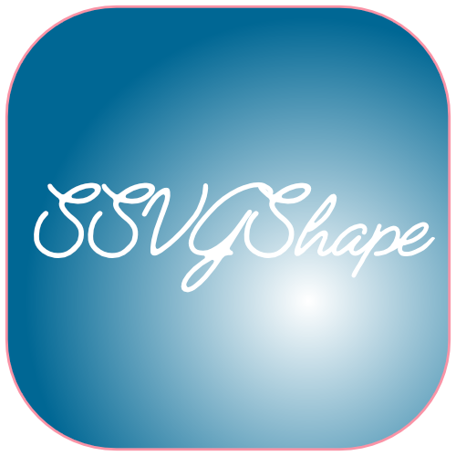

<p align="center">
    
</p>
<p align="center">
    
    <a href="https://swift.org/package-manager">
        
    </a>
    
</p>


# SSVGShape

**SSVGShape** — a simple library that parses and converts SVG files to SwiftUI shapes which can be animated.

SSVGShape supports SVG v1.1 and may not work with different SVG file format


## SVG 1.1 valid file format 

Example of valid SVG file. Notice the transform tag, it is essential to have transform matix rather than translate. scale, roatate, skew tags seperatley. SSVGShape supports only absolute coordinates (capital letters M,C,L,Z) and won't work with relative coordinates (lower letters).  All vectors expoerted using Affinity desginer with options (selection without background) should work with this release.

```xml
<?xml version="1.0" encoding="UTF-8" standalone="no"?>
<!DOCTYPE svg PUBLIC "-//W3C//DTD SVG 1.1//EN" "http://www.w3.org/Graphics/SVG/1.1/DTD/svg11.dtd">
<svg width="100%" height="100%" viewBox="0 0 298 269" version="1.1" xmlns="http://www.w3.org/2000/svg" xmlns:xlink="http://www.w3.org/1999/xlink" xml:space="preserve" xmlns:serif="http://www.serif.com/" style="fill-rule:evenodd;clip-rule:evenodd;stroke-linecap:round;stroke-linejoin:round;stroke-miterlimit:1.5;">
    <g transform="matrix(1,0,0,1,-178.831,-143.889)">
        <path d="M179.331,411.691L344.404,150.403C344.404,150.403 383.269,410.374 453.669,330.229C524.069,250.083 375.012,120.315 476.244,148.262" style="fill:none;stroke:black;stroke-width:1px;"/>
    </g>
</svg>
```

## How to use the library

Import the library using swift package manager and creat new SwiftUI project then use the following code

```swift

struct ContentView: View {
    static let gradientStart = Color.yellow
    static let gradientEnd = Color.orange

    let shape =  SSVGShape<SVGReader11>(reader: SVGReader11(filePath: Bundle.main.path(forResource: "bitcoin", ofType: "svg")!))
    
    @State var visible = false
    
    var body: some View {
    VStack {
        shape
            .trim(from: 0, to: visible ? 1 : 0)
            .fill(LinearGradient(gradient: Gradient(colors:
                                [Self.gradientStart, Self.gradientEnd]),
                                startPoint: UnitPoint(x: 0.5, y: 0),
                                endPoint: UnitPoint(x: 0.5, y: 0.6)))
            .aspectRatio(1, contentMode: .fit)
            .padding()
            .frame(width: 380, height: 380, alignment: .center)
    
        
        
    Button(action: { withAnimation(Animation.easeInOut(duration: 2)) {
        self.visible.toggle()
        
    }
    }) { Text("Animate") } }
    }
}
```


## Installation

SSVGShape is distributed as a Swift package, and it’s recommended to install it using [the Swift Package Manager](https://github.com/apple/swift-package-manager), by declaring it as a dependency in your project’s `Package.swift` file:


## Showcases


## Dependencies

SSVGShape requires  


## Contributions & support

SSVGShape is developed completely in the open, and your contributions are more than welcome.
